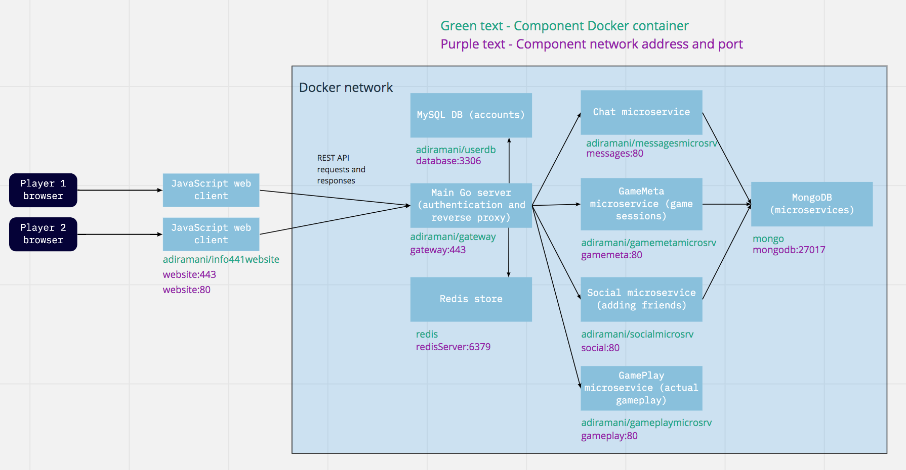
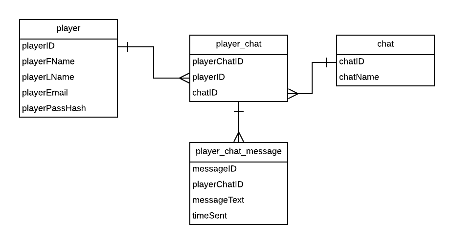

# INFO441-Battleships

Created by Aditya Ramani, Beichen Liang, Liam O'Keeffe, and Liam Sexton

## Project Description:

We built an online battleship game for our project. Our target audience is people who are feeling disconnected from their friends over the past few months due to the extenuating circumstances of COVID-19 and want to find a way to play games with their friends. These people will want to use our application because it is fun game that they can play with their friends. There are a few online battleship games in the market, but not many of them have a chat feature, where people can connect with the people they are playing against and converse (or even trash talk!). Users can also play against random opponents. As developers, we wanted to build this app because it will enable our target audience to connect and have fun with others. In addition, all of us love playing battleships too, so we can enjoy the application with our friends once we've finished!

## Technical Description:

#### Architectural diagram:

#### User Stories

Priority|User|Function/Description|Technology/Implementation|Implemented?
--------|----|--------------------|-------------------------|:------:
P0|As a player|I want to create an account on the website|Create a new entry in the Player table and allow me to log into the website using the email and password provided|Yes
P0|As a player|I want to create a game for another person to join via code|Create a game with a code that I can give to a friend to join with|Yes
P0|As a player|I want to make moves and win a game vs another player|Click on a spot in the board and have it send a move to my opponent|Yes
P0|As a player|I want to join a game via code|Text Input for a code which, once submitted, connects you to the other player|Yes
P1|As a player|I want to create a public game|Create a game that is accessable by anyone who wants to join randomly. If a public game is available, join the game.|Yes
P1|As a player|I want to join game via search for public lobbies|I start a game without entering a code and it connects me to a random player. If no public games available, it creates a game.|Yes
P2|As a player|I want to play games against the CPU. |Randomly generated battleship board that the player can target. Server randomly attacks player.|No
P2|As a player|I want to chat with other players while playing|Have a chat option for any of my friends, or someone that I am currently in a game with. It will store messages in a database. The chats with random users will only last while in the game.|Yes
P3|As a player|I want to make a group chat with people I play with often|Create an entry in the chat table, and as many entries in the player_chat table as users requested. Open a websocket pipeline to be able to receive and send messages. Messages stored in the player_chat_messagetable|No

The user stories not implemented above would likely be implemented in a future iteration of the project.

#### Endpoints

*all of these endpoints require authorization in the header*
**Player/Session Endpoints:**
* POST /v1/users - create a new user in the database
  * Input: Player sign up information (JSON)
    * userName (string)
    * firstName (string)
    * lastName (string)
    * email (string)
    * password (string)
    * passwordConf (string)
  * Output: 
    * New Player account with ID (JSON)
      * Without email or password hash
    * Start a new player session as well
* GET /v1/player/{id} - get a players information from ID or the currently authenticated user
  * Input: 
    * id parameter
  * Output: 
    * Player account for the specified ID in JSON
    * Get ID of currently authenticated user from session store if id == ‘me’
* POST /v1/sessions - start a session for a user based on sign in information
  * Input: User sign in information
    * email (string)
    * password (string)
  * Output: 
    * Player account for the authenticated user in JSON
    * Begin session for user by assigning a session ID if credentials match user information in player database
    * Any errors
* DELETE /v1/sessions/mine
    * Output: 
      * Plain text confirming session has ended
      * End the current authenticated user’s session

**Social Endpoints:**
* GET /v1/friends
  * Input:
    * Just auth
  * Output: 
    * JSON object of all friends and friend requests for user
    * Any errors
* POST /v1/friends/{username}
  * Input: 
    * friend username - username of friend you want to make the request about
    * accepted (bool) - is it a request to accept or a new req
    * rejected (bool) - is it a request to reject
  * Output: 
    * Success/Failure message
* GET /v1/friends/{partialUserName}
  * Input: 
    * partial username (string)
  * Output: 
    * Array of user objects whose username starts with the partial username
    * Any errors

**Chat Endpoints:**
* POST /v1/channels - create a chat with another player based on body info
  * Input: JSON of a chat model in request body
    * name (string) - name of the channel
    * private (bool) - whether it is a private channel
    * description (string) optional - channel description
    * otherUserName (string) - username of the other member of the channel
  * Output: 
    * New Chat model in JSON with ID
    * Errors if any occur
* GET v1/channels?friendid= - get a certain chat room based on another user's id
  * Input: 
    * optional friendid url parameter
  * Output: 
    * if friendid provided
      * Get the channels with both the user and the friend
    * else
      * A list of channel objects the user is a member of
    * Errors if any occur
* WEBSOCKET /v1/chat/{id}/message - pipeline for messages for a given chat id. Can only be accessed if user is authorized to see it
  * Input
    * chat ID from request URL
    * Receiving
      * Ensure user is member of chat & currently authenticated
    * Sending
      * Ensure user is authorized to send message in given chat id & currently authenticated
      * If message is being sent, the message text will be in the request body
  * Output: 
    * Receiving
      * Array of most recent chat message models for the given chat id in JSON
      * Any errors that occur
    * Sending
      * Chat message model in JSON with new ID, status 201
      * Any errors that occur

**Game Endpoints:**
* GET /v1/game - get an available public game
  * Output: 
    * If there is a public available game, return the game object
    * Else return 400 error with text "No games available"
* POST /v1/game - create a new game, return a gameID
  * Input: 
      * public (bool) - whether the game is public or not
  * Output: 
    * New game model in JSON with new ID
    * Error if one occurs
* GET /v1/game/{id} -return game information to play the game based on game id, if it exists
  * Input: 
    * gameID from request URL
  * Output: 
    * Game model in JSON
    * Error if one occurs
* WEBSOCKET /v1/game/play/- pipeline for moves in a game provided by a certain ID
  * Input: 
    * Ensure a player is authorized, a player in the specified game, and it is their current turn
    * Client Sending
      * If its the first message, it will send the ship locations and gameid
      * The move information (name and location) will be passed as json in the request body
  * Output: 
    * Client Receiving
      * If first message back, it will send the opposing player's board when matched
      * Otherwise it will send back the outcome of your move or your opponent's move
      * Any errors
    * Server Sending
      * Any failure errors
      * Move information encoded in a string
* DELETE /v1/game/{id} - end a game. Only accessed if a game is won, or if a player forfeits
  * Input: 
    * gameID from request URL
  * Output: 
    * Plain text confirming end of game/result
  * Only allowed if a player doesn't get matched with an opponent and severs the connection with the server

## Database Schema:
https://app.lucidchart.com/invitations/accept/0697ccf4-8483-4385-9f6d-fc84ec2417ca

 